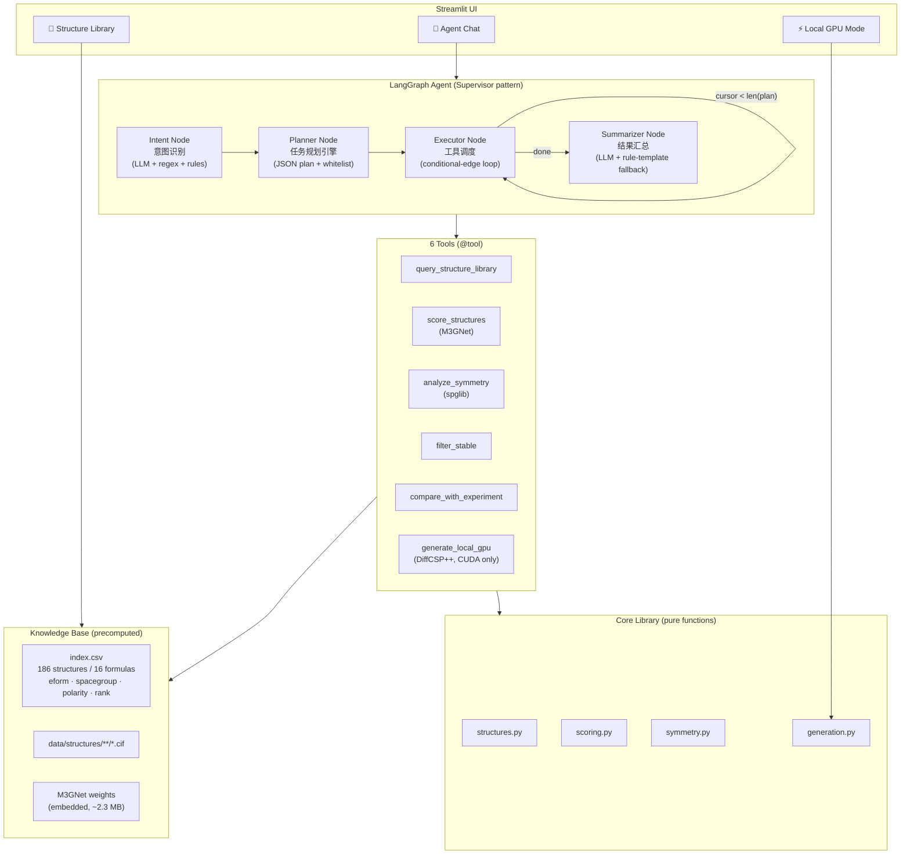

# 💎 Crystal Structure Agent

**An LLM agent that turns natural language into crystal-structure discovery — diffusion-based generation, ML interatomic-potential scoring, symmetry analysis, and experiment comparison, all behind one chat interface.**

[](https://www.langchain.com/langgraph)
[](https://open.bigmodel.cn/)
[](https://github.com/materialsvirtuallab/matgl)
[](https://github.com/jiaor17/DiffCSP-PP)
[](https://streamlit.io)
[](LICENSE)

> 🚀 **Live demo**: this repo is a ready-to-deploy Hugging Face **Streamlit Space** — see [Deploy your own](#-deploy-your-own-hf-space) below.

---

## Why I built this

I work on computational screening of layered phosphate halides (the MPX₃-derived family, e.g. GaPSe₃I — our lab has an experimental C2/c reference structure). The full research loop is: **generate candidate structures → score stability → analyze symmetry → compare with experiment**. That loop used to take me half a day of gluing scripts together for *one* composition.

So I built this project: an end-to-end system where you type

> *"找出最稳定的结构并分析它们的对称性"*

and an agent plans the tool chain, executes it, and hands you back a Markdown report with 3D structures you can rotate in the browser. It is also my answer to a real engineering question: **how do you put a domain-science workflow behind an LLM agent without making it fragile?** My approach: strict tool whitelisting, rule-based fallbacks at every LLM boundary, and graceful degradation when hardware (GPU) is unavailable.

## Architecture



**Design decisions worth noting:**

- **Every LLM boundary has a rule-based fallback.** Intent recognition, planning, and summarization each degrade to deterministic rules/templates if the LLM call fails or returns malformed JSON. The demo works fully without any API key.
- **Agent-aware hardware capability.** `generate_local_gpu` checks CUDA at call time and returns a graceful-degradation dict instead of crashing — the agent *tells you* why it can't generate, rather than erroring out.
- **Precomputed knowledge base + on-demand scoring.** `index.csv` (precomputed formation energy, space group, polarity, rank) is the fast path; M3GNet scoring on-the-fly (`torch.inference_mode()`, thread-capped, cached model resource) is used for re-scoring and uploads.
- **Performance controls for free-tier hosting**: `st.cache_resource` for model/LLM/graph singletons, `st.cache_data` for index loads and per-structure symmetry analysis, `torch.set_num_threads(2)` for 2-vCPU Spaces.

## What you can do with it

| Page | What it does |
|---|---|
| 🏠 Home | Project intro, architecture diagram, live environment self-check (M3GNet / API key / CUDA) |
| 💬 Agent Chat | Natural-language queries — the agent shows its **intent → plan → tool trace → report** |
| 🧊 Structure Library | Filter 186 structures by formula/energy/space group, rotate 3D ball-stick models (stmol + py3Dmol), re-score any structure with M3GNet |
| ⚡ Local GPU Mode | Full DiffCSP++ diffusion generation (1000-step sampling) — needs a local CUDA GPU |

**Example agent queries** (Chinese or English):

```text
浏览 GaPS3I 的结构
找出最稳定的结构并分析它们的对称性        # triggers 3-tool chain: query → filter → symmetry
生成的结构和实验结构对比一下              # triggers compare_with_experiment (C2/c reference)
```

## Quick start (local, CPU is enough)

```bash
git clone https://github.com/<your-name>/crystal-structure-agent.git
cd crystal-structure-agent
pip install -r requirements.txt

# Optional: enable the LLM brain (otherwise rule-based mode, still fully functional)
# Get a free key at https://open.bigmodel.cn/  — GLM-4-Flash is free
set ZHIPU_API_KEY=your_key        # Windows
# export ZHIPU_API_KEY=your_key   # Linux/macOS

streamlit run app.py
```

> ⚠️ **Security note**: never commit `ZHIPU_API_KEY` to git. On Hugging Face Spaces, put it in *Settings → Variables and secrets* instead. `.gitignore` already excludes `.env` and secrets files.

## Deploy your own HF Space

The repo root carries the Streamlit Space frontmatter (see top of this file), so deployment is a git push:

```bash
# 1. Create an empty Streamlit Space on huggingface.co (SDK: Streamlit, app_file: app.py)
git remote add space https://huggingface.co/spaces/<your-name>/crystal-structure-agent
git push space main

# 2. Add ZHIPU_API_KEY in Space Settings → Secrets (optional but recommended)
```

First build takes ~10 min (CPU torch wheel ≈ 200 MB). Cold start runs the environment self-check on the home page.

## Local GPU generation (optional)

The hosted demo ships a **precomputed library** (186 structures across 16 MPX₃I-family compositions) because DiffCSP++ needs a GPU. On your own CUDA machine:

```bash
pip install chemparse torch_geometric
# Point to your DiffCSP++ checkout + mp_csp checkpoint
set DIFFCSP_ROOT=G:\path\to\DiffCSP-main
python scripts/generate_gpu.py --formula GaPSe3I --num 3 --out outputs/
```

Unset/no-GPU environments degrade gracefully — both the agent tool and the Streamlit page explain what is missing instead of crashing.

## Project structure

```
crystal-structure-agent/
├── app.py                     # Home: intro + architecture + self-check
├── pages/                     # Streamlit multi-page app
│   ├── 1_Agent_Chat.py        # Agent conversation + trace viewer
│   ├── 2_Structure_Library.py # Browser + 3D viewer + re-scoring
│   └── 3_Local_GPU_Mode.py    # DiffCSP++ generation (CUDA)
├── agent/                     # LangGraph agent
│   ├── graph.py               # intent → planner → executor → summarizer
│   ├── tools.py               # 6 @tool definitions (whitelisted)
│   ├── prompts.py             # system/intent/planner/summarizer prompts
│   ├── llm.py                 # GLM-4-Flash (OpenAI-compatible)
│   └── state.py               # AgentState TypedDict
├── core/                      # Pure-function science library
│   ├── structures.py          # CIF I/O, index loading
│   ├── scoring.py             # M3GNet formation energy (+ fallback)
│   ├── symmetry.py            # spglib space group + polarity
│   └── generation.py          # DiffCSP++ wrapper (lazy imports)
├── data/
│   ├── structures/**/*.cif    # 186 generated structures
│   ├── index.csv              # precomputed knowledge base
│   ├── top30_summary.csv      # TOP30 ranked results
│   ├── reference/             # experimental GaPSe3I (C2/c)
│   └── models/matgl/          # embedded M3GNet weights (~2.3 MB)
├── scripts/
│   ├── export_library.py      # one-shot data pipeline (local)
│   ├── generate_gpu.py        # CLI generation
│   └── smoke_test_agent.py    # agent end-to-end tests
└── docs/                      # deep-dive notes (Chinese)
```

## Validation

```bash
python scripts/smoke_test_agent.py
```

Covers: single-intent browsing, composite-intent multi-tool chains (query → filter → symmetry, query → compare), plan-whitelist assertions, and GPU-tool degradation on CPU-only environments. Current status: **all pass, 0 failures** (rule-based and LLM modes).

## Roadmap

- [ ] DFT relaxation (VASP/CP2K) of TOP30 candidates as a second-round referee
- [ ] Multi-agent debate: a "critic" agent that challenges the planner's tool choices
- [ ] RAG over Materials Project / ICSD entries for prior-informed generation
- [ ] Async tool execution (`asyncio`) for parallel M3GNet scoring
- [ ] Multimodal input: upload an XRD pattern, agent matches candidate structures

## Acknowledgments

This project stands on the shoulders of two open-source models and their authors' excellent work:

- **DiffCSP++** — *Space Group Constrained Crystal Generation* (ICLR 2024) by **Rui Jiao, Wenbing Huang, Yu Liu, Deli Zhao, Yang Liu** (Tsinghua University & Renmin University of China). The diffusion model that generates crystal structures from a composition string. Code: [jiaor17/DiffCSP-PP](https://github.com/jiaor17/DiffCSP-PP).
- **M3GNet** — *A universal graph deep learning interatomic potential for the periodic table* (Nature Computational Science, 2022) by **Chi Chen, Shyue Ping Ong** (UCSD / Materials Virtual Lab). The universal ML interatomic potential that scores formation energies in this project. Code: [materialsvirtuallab/matgl](https://github.com/materialsvirtuallab/matgl).

I am deeply grateful to both teams for releasing their models and weights openly. Without their contributions, this end-to-end system would not be possible.

I also acknowledge [spglib](https://github.com/spglib/spglib) by Togo et al. for space-group analysis, [pymatgen](https://github.com/materialsproject/pymatgen) by the Materials Project team for crystal I/O, and [GLM-4-Flash](https://open.bigmodel.cn/) by Zhipu AI for the free LLM inference.

## License

MIT — see [LICENSE](LICENSE). The M3GNet weights are redistributed per the [matgl](https://github.com/materialsvirtuallab/matgl) project's terms; DiffCSP++ itself is **not** included in this repo (bring your own checkout for GPU generation).
